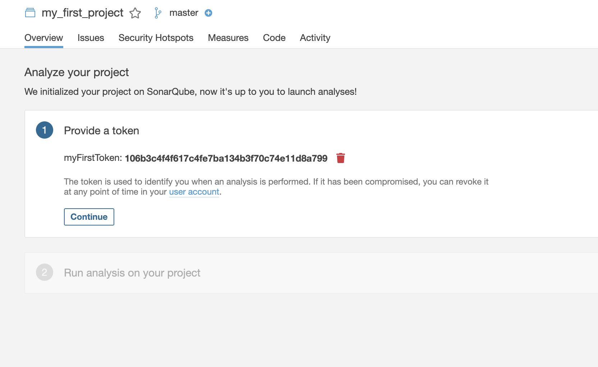

# Sonar Cube 설치하기 

Sonar Cube 는 대표적인 정적분석 툴입니다. 

정적 분석툴은 프로그램을 실행하지 않고, 작성 단계에서 이미 코드내 문제점을 파악하고, 수정할 수 있도록 가이드 해 주는 툴입니다. 

우리는 Mac 을 기준으로 Sonar cube 분석 서버를 설치하고, 스프링 프로젝트와 연동하여 테스트를 수행할 수 있있는 방법을 알아보겠습니다. 

## 사전 정보 

- Mac 을 기준을 설치 및 코드를 작성합니다. 
- IntelliJ 플러그인을 이용합니다. 
- Maven 을 이용합니다. 

## Install on Mac

우선 Sonar Cube 를 Mac 환경에 설치 해보겠습니다. 

### brew 를 이용한 설치 


#### brew install 

```
brew install sonar

brew install sonar-scanner
```

설치하고나면 다음과 같이 path 를 걸어줍니다.  

```text
export SONAR_HOME=/usr/local/Cellar/sonar-scanner/3.2.0.1227/libexec  
export SONAR=$SONAR_HOME/bin
export PATH=$SONAR:$PATH

```

#### 실행하기. 

```
/usr/local/opt/sonarqube/bin/sonar console
```

실행하고 정상적으로 연결 되었는지 확인합니다. 

http://localhost:9000 에 접근하면 다음과 같은 화면을 볼 수 있습니다. 


기본 환경이 로드되면 첫번째 화면이 다음과 같이 나타납니다. 


### Docker 로 설치하기. 

https://hub.docker.com/_/sonarqube 에서 공식 이미지를 확인합니다. 

```text
docker run -d -p 9000:9000 sonarcube
```

production 모드나 실제 프로젝트에서 사용하실 때에는 docker 설명서에서 ES와 DB 연동 부분을 확인하여 실행하세요. 

https://docs.sonarqube.org/latest/setup/install-server/

#### 로그인하기. 

Login 버튼을 클릭합니다. 

초기 관리자 아이디와 비밀번호는 admin/admin 입니다. 


## 메인 화면. 


## 프로젝트 생성하기.

sonar cube 를 연동하기 위해서 첫번째 할 일은 프로젝트를 하나 생성하는 것입니다. 


위 화면에서 create new project 버튼을 클릭합니다. 

### 프로젝트 기본 설정 


보는바와 같이 화면이 나타나면 프로젝트 키와 디스 플레이 이름등을 지정합니다. 

저는 그냥 my_first_project 로 작성했습니다. 

### 토큰 생성하기. 

sonar cube 에서 소스 검사를 하기 위해서는 토큰을 생성해야합니다. 

토큰 생성을 다음과 같이 해줍니다. 




토큰을 잘 기억해 두세요. 

### 분석할 프로그래밍 언어 선택 . 

우리는 자바 프로젝트를 이용할 것이기 때문에 Java 를 클릭합니다. 


Maven 을 이용했으므로 Maven 을 아래와 같이 선택해줍니다. 


그럼 하단에 maven 커맨드가 나타납니다. 

이 코드는 꼭 별도 저장하거나 기억해 두세요. 

```text
mvn sonar:sonar \
  -Dsonar.projectKey=my_first_project \
  -Dsonar.host.url=http://localhost:9000 \
  -Dsonar.login=106b3c4f4f617c4fe7ba134b3f70c74e11d8a799
```

위 명령어를 실행하면 sonar cube 를 통해서 테스트를 할 수 있습니다. 

## 참고사항: 

지금까지 생성한 sonar cube 는 개발을 위한 테스트 용입니다. 

실제 sonarqube 내장 elastic search, h2 database 된를 이용합니다.

그러므로 실제 프로젝트에서 사용하기 위해서는 다음 문서를 꼭 참고하여 데이터베이스와, ES 연동을 위한 설정을 해 주어야합니다. 

[Install](https://docs.sonarqube.org/latest/setup/install-server/)

## 테스트하기. 

이제 스프링 프로젝트를 하나 만듭니다. 

https://start.spring.io/ 에 접속하여 아래와 같이 작성하고, 다운로드 합니다. 


generate 버튼을 클릭하여 소스를 다운받습니다. 

### Controller 생성하기. 

IDEA 로 소스를 열었다면 com/eunkong/eschool/sonacubetest/resources/DemoRestController.java 파일을 하나 만듭니다. 

코드는 다음과 같이 작성해 주세요. 

```java
package com.eunkong.eschool.sonacubetest.resources;

import org.springframework.http.ResponseEntity;
import org.springframework.web.bind.annotation.RequestMapping;
import org.springframework.web.bind.annotation.RequestMethod;
import org.springframework.web.bind.annotation.RequestParam;
import org.springframework.web.bind.annotation.RestController;

@RestController
public class DemoRestController {

    @RequestMapping(value = "/api/v1/capitalize")
    public ResponseEntity<String> capitlize(@RequestParam("test") String text) {
        String capital = text.toUpperCase();
        return ResponseEntity.ok(capital);
    }
}

```

작성을 다 하셨다면 소스 디렉토리로 이동합니다. 

그리고 이전 sonar cube 에서 복사해 두었던 maven 명령을 실행합니다. 

```text

sona-cube-test % mvn sonar:sonar \
>   -Dsonar.projectKey=my_first_project \
>   -Dsonar.host.url=http://localhost:9000 \
>   -Dsonar.login=106b3c4f4f617c4fe7ba134b3f70c74e11d8a799
[INFO] Scanning for projects...
[INFO] 
[INFO] -----------------< com.eunkong.eschool:sona-cube-test >-----------------
[INFO] Building sona-cube-test 0.0.1-SNAPSHOT
[INFO] --------------------------------[ jar ]---------------------------------
[INFO] 
[INFO] --- sonar-maven-plugin:3.7.0.1746:sonar (default-cli) @ sona-cube-test ---
[INFO] User cache: /Users/kidobae/.sonar/cache
... 중략 
[INFO] Load global settings (done) | time=232ms
... 중략 
[INFO] Quality profile for java: Sonar way
[INFO] Quality profile for xml: Sonar way
[INFO] ------------- Run sensors on module sona-cube-test
... 중략 
[INFO] ------------- Run sensors on project
[INFO] Sensor Zero Coverage Sensor
[INFO] Sensor Zero Coverage Sensor (done) | time=15ms
[INFO] Sensor Java CPD Block Indexer
[INFO] Sensor Java CPD Block Indexer (done) | time=34ms
... 중략 
[WARNING]   * src/main/java/com/eunkong/eschool/sonacubetest/resources/DemoRestController.java
[WARNING] This may lead to missing/broken features in SonarQube
... 중략 
[INFO] ANALYSIS SUCCESSFUL, you can browse http://localhost:9000/dashboard?id=my_first_project
[INFO] Note that you will be able to access the updated dashboard once the server has processed the submitted analysis report
[INFO] More about the report processing at http://localhost:9000/api/ce/task?id=AXEu8qQdmTWN2Kdv-dL8
[INFO] Analysis total time: 11.916 s
[INFO] ------------------------------------------------------------------------
[INFO] BUILD SUCCESS
[INFO] ------------------------------------------------------------------------
[INFO] Total time:  15.374 s
[INFO] Finished at: 2020-03-31T13:56:26+09:00
[INFO] ------------------------------------------------------------------------


```

Maven 명령어가 성공적으로 수행되었습니다. 

## Sonar cube 결과 살펴보기. 

 

결과를 보시면 취약점 1개가 보고 되었습니다. 클릭해 보겠습니다. 

### 취약점 결과 살펴보기. 


@RequestMapping 을 수행할때 메소드를 지정하지 않았다는 취약점이네요. 

이게 왜 이슈인지 확인하려면. 리스트에서 "Why is this an issue?" 을 클릭하면 다음과 같이 하단에 왜 이것이 이슈인지 알려줍니다. 


### 상세 소스코드 살펴보기. 

목록을 클릭하면 다음 화면을 볼 수 있습니다. 


### 코드 수정하기. 

가이드대로 코드를 수정하고 다시 maven 커맨드를 실행합니다. 

```java
@RequestMapping(value = "/api/v1/capitalize")
```
위 코드를 아래와 같이 바꿔줍니다. 

```java
@GetMapping(value = "/api/v1/capitalize")
```

위와 같이 수정하고, maven 명령을 수행한 결과는 다음과 같습니다. 


## 결론 

지금까지 Sonar Cube 를 로컬에 설치하고, 테스트해 보았습니다. 

Sonar Cube 를 이용하면 프로그램이 동작하면서 발생되는 치명적인 이슈를 사전에 해결할 수 있습니다. 

개발, 운영등 파이프라인툴 (Jenkins) 등을 이용하여 설정해두면, 코드의 퀄리티를 향상 시킬 수 있습니다. 

실제로 설치해 보면서 다양한 사용법을 익혀보세요. 


