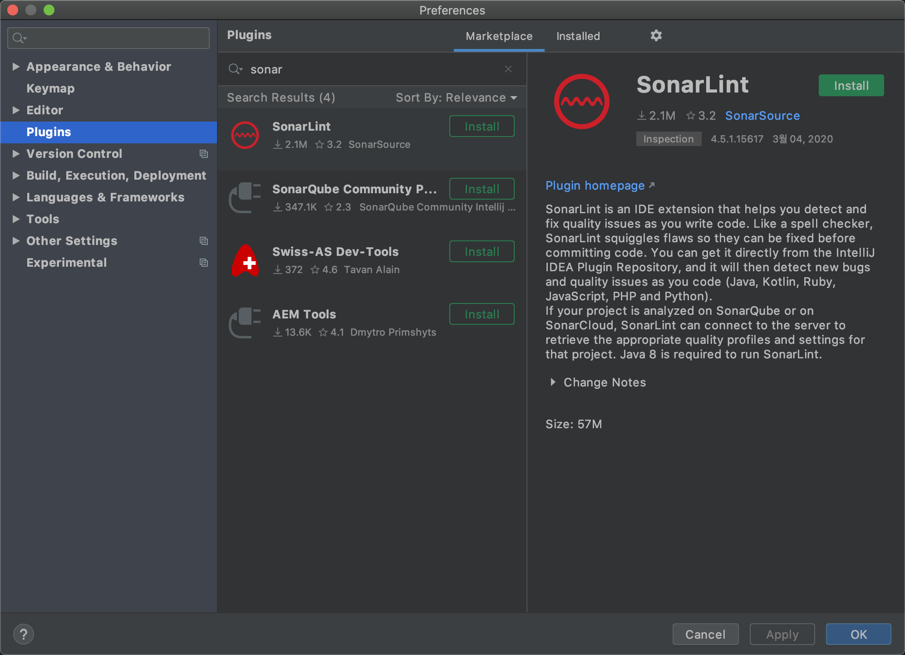
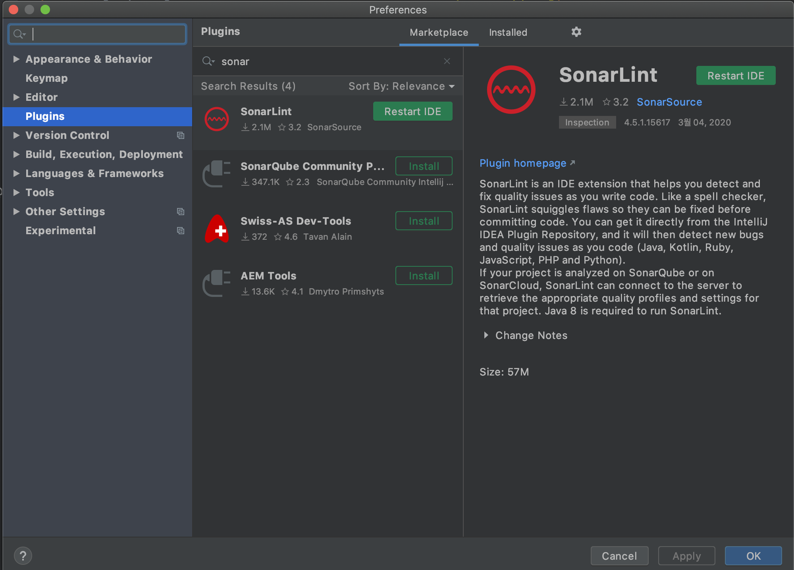
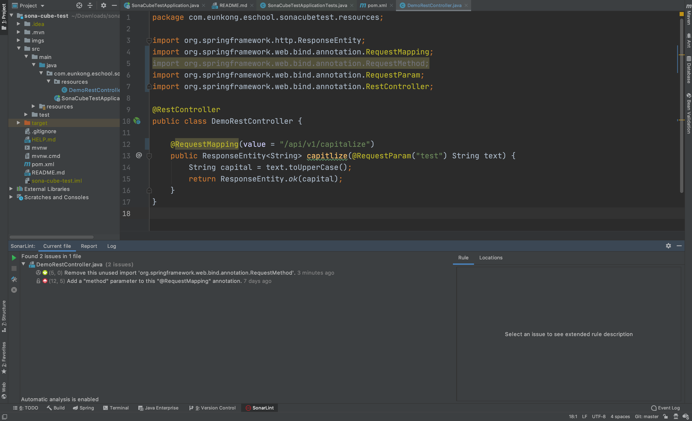
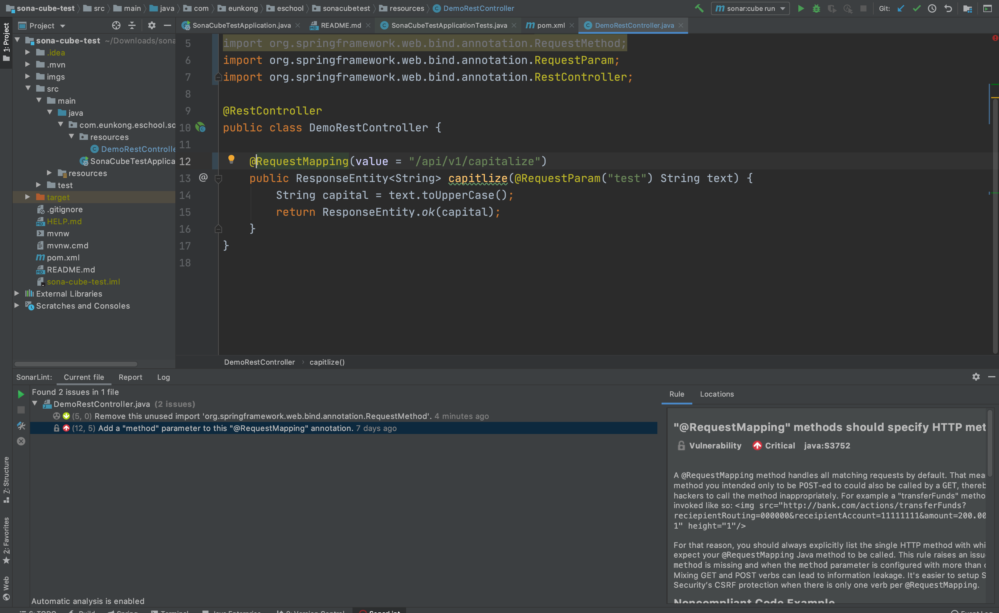
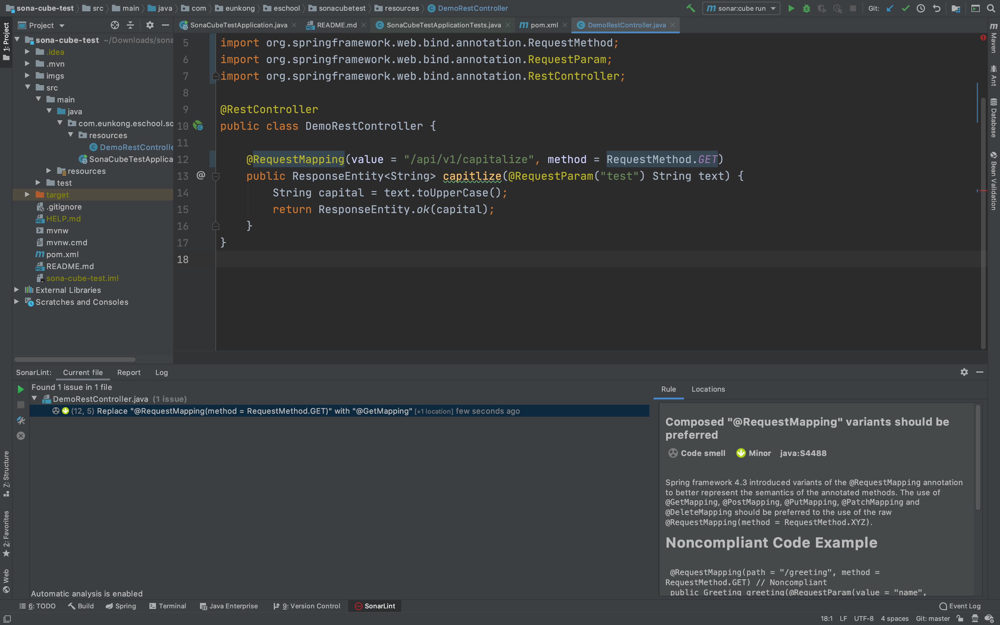
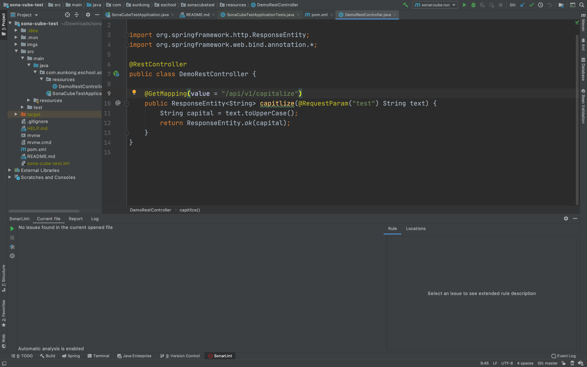

# IntelliJ SonaLint Plugin

Sonar Cube 를 이용하여 정적 결함을 분석하면 코드 퀄리티가 올라갑니다. 

이를 위해서 서버를 설치하여, 공용으로 이용하는 방법이 있고, 다른 한가지로는 IDE 툴에 설치해두고, 

개발자 자체로 1차 분석을 수행하는 방법이 있습니다. 

우리는 이 중 2번째 IDEA 에 설치하여 이용하는 방법을 알아 보겠습니다. 

## IntelliJ Plugin 설치하기. 

일단 IntelliJ 를 이용하고 있다고 가정하겠습니다. 

IntelliJ > Preference 를 선택하거나, 혹은 Mac 에서 command + ',' 를 클릭합니다. 

설정 화면이 열리면 아래와 같이 Plugin 메뉴를 선택합니다. 

그리고 Marketplace 를 선택하고, "SonarLint" 를 검색합니다. 



설치를 하고나면 리스타트 해줍니다. 



## SonarLint 탭 확인하기. 

다시 Intellij 가 오픈이 되면 아래 툴 중 SonarLint 를 크릭하면 SonarLint 가 수행한 결과를 확인할 수 있습니다. 



헛 벌써 오류가 나타나네요. 

코드를 살펴보겠습니다. 
com/eunkong/eschool/sonacubetest/resources/DemoRestController.java

코드는 다음과 같습니다. 

```java
package com.eunkong.eschool.sonacubetest.resources;

import org.springframework.http.ResponseEntity;
import org.springframework.web.bind.annotation.RequestMapping;
import org.springframework.web.bind.annotation.RequestMethod;
import org.springframework.web.bind.annotation.RequestParam;
import org.springframework.web.bind.annotation.RestController;

@RestController
public class DemoRestController {

    @RequestMapping(value = "/api/v1/capitalize")
    public ResponseEntity<String> capitlize(@RequestParam("test") String text) {
        String capital = text.toUpperCase();
        return ResponseEntity.ok(capital);
    }
}


```

SonarLint 가 알려주는 행을 더블클릭하면 문제 코드를 확인할 수 있습니다. 



를 보면 붉은색으로 취약점이 있음을 알려줍니다. 

RequestMapping 에서 요청 메소드를 지정하지 않았다고 하네요. 

```java
    @RequestMapping(value = "/api/v1/capitalize", method = RequestMethod.GET)
```

으로 변경하였습니다. 



이번에는 권고사항으로 @GetMethod 를 이용하라고 하는군요. 

```java
@GetMapping(value = "/api/v1/capitalize")
```
으로 바꾸어 줍니다. 



오류가 사라졌습니다. 

## 결론

IntelliJ 는 서버에서 설치된 Sonar Cube 가지는 기능보다는 약하지만, 기본적으로 개발 진행중에 
발생하는 다양한 정적 결함을 사전에 제거할 수 있는 장점이 있습니다. 

Server 를 설치한 Sonar Cube 는 

- 공통 Policy 적용
- 더욱 정교한 Policy 수정
- 결함 제거 Burn Down Chart 등의 활용

등 다양한 이점이 있습니다. 

그래도 로컬에서 사전에 미리미리 코드를 개선하는 방법도 전체적인 코드 품질 향상에 매우 큰 효과를 줍니다. 


